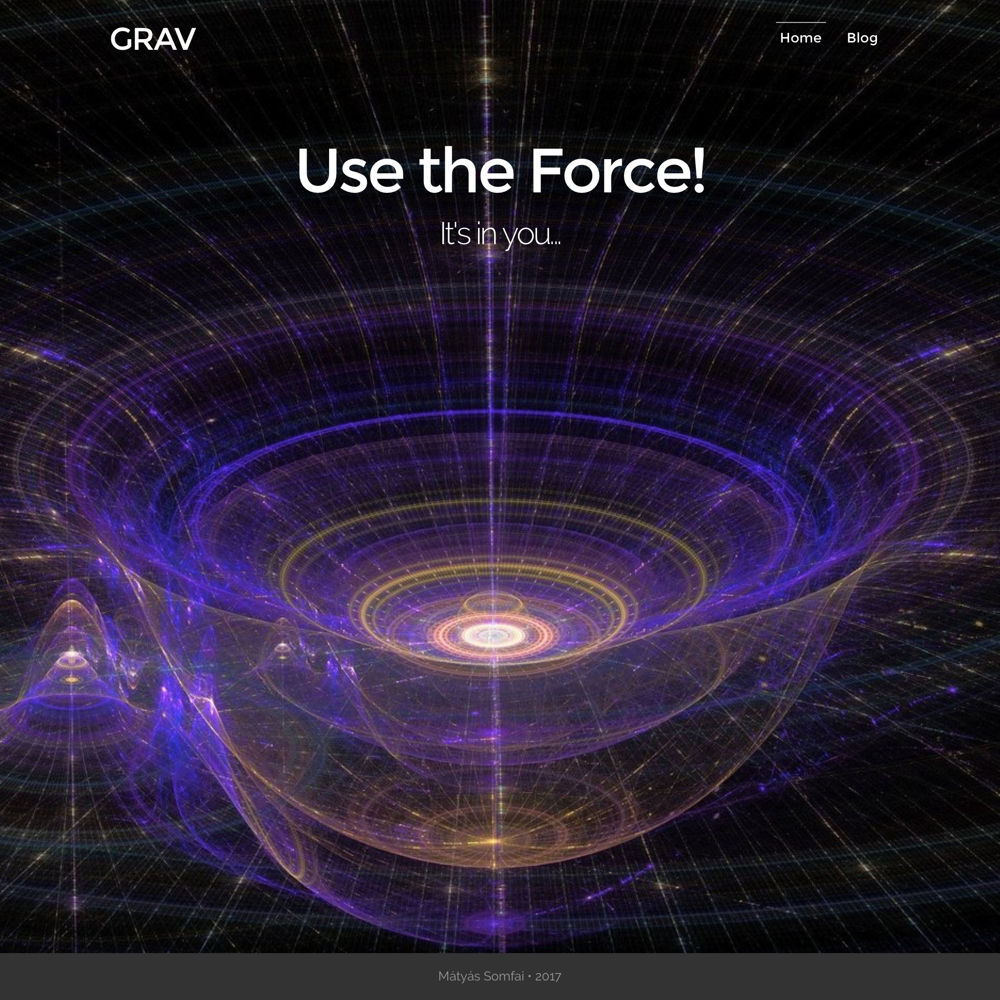

# Force Theme

The **Force** Theme is for [Grav CMS](http://github.com/getgrav/grav).  

## Description

Force is a customized version of the Antimatter Grav theme.



## Usage

To create a full-screen landing page, use the `modular_fs` type.
Example content of `modular_fs.md`:

```markdown
---
title: Home
onpage_menu: false
body_classes: "modular welcome header-image fullwidth"

content:
    items: @self.modular
    order:
        by: default
        dir: asc
        custom:
            - _welcome
---
```

Add your custom welcome image into the `_welcome` modular content folder, next to the `welcome.md` that will be the content of the landing page.
Your directory should look something like this:

```
❯❯❯ tree 01.home
01.home
├── _welcome
│   ├── welcome.jpg
│   └── welcome.md
└── modular_fs.md
```
